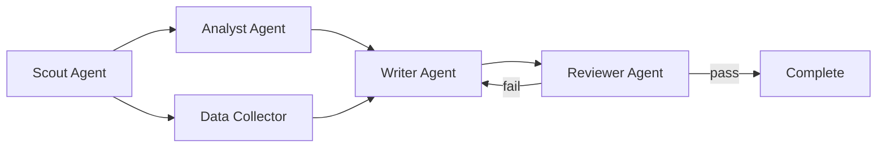

DAG orchestration replaces linear agent pipelines with directed acyclic graphs. Agents become nodes, data flows along edges, and you get parallel branches, conditional routing, and rollback on failure — all declarative.

<Note>
DAG orchestration is available in ClawHQ v2026.4+ via the Paperclip service.
</Note>

## Why not linear pipelines

Linear pipelines (agent A → agent B → agent C) break down when you need:

- **Parallelism** — run research and analysis simultaneously
- **Conditional routing** — skip steps based on intermediate results
- **Error recovery** — rollback to a checkpoint and retry with a different strategy
- **Fan-out/fan-in** — split work across multiple agents, then merge results

DAGs handle all of these natively.

## How it works



Each node is an agent. Each edge carries data (findings, context, instructions) from one agent to the next. The engine executes nodes in topological order, respecting dependencies.

## YAML syntax

```yaml
apiVersion: clawhq.io/v1
kind: DAGWorkflow
metadata:
  name: research-pipeline
spec:
  budget:
    limit: 25.00
    hard_stop: true

  nodes:
    - id: scout
      agent: clawhq://web-scout
      config:
        max_sources: 20
        depth: thorough
      checkpoint: true

    - id: analyst
      agent: clawhq://analyst
      depends_on: [scout]
      checkpoint: true
      retry:
        max_attempts: 2
        delay: 10s

    - id: writer
      agent: clawhq://writer
      depends_on: [analyst]
      checkpoint: true

    - id: reviewer
      agent: clawhq://reviewer
      depends_on: [writer]
      on_failure:
        action: rollback
        target: writer
        max_rollbacks: 1

  edges:
    - from: scout
      to: analyst
      data: findings
    - from: analyst
      to: writer
      data: analysis
    - from: writer
      to: reviewer
      data: draft
```

## Memory snapshots and rollback

Before each checkpointed node executes, the engine snapshots:

- **Memory state** — Mem0 collection snapshot for the agent
- **Context window** — conversation history and system prompt
- **Tool state** — connected integrations and their auth tokens
- **File handles** — any files the agent has open or created

On failure, the engine can:

1. **Rollback to checkpoint** — restore the snapshot and retry with the same agent
2. **Rollback and escalate** — restore and route to a fallback agent
3. **Rollback and skip** — restore, mark the node as skipped, continue downstream

```yaml
reviewer:
  on_failure:
    action: rollback        # rollback | skip | halt
    target: writer          # which node to restore to
    max_rollbacks: 2        # prevent infinite loops
    fallback_agent: clawhq://senior-reviewer
```

## Error handling

Every node supports retry and fallback policies:

```yaml
- id: analyst
  agent: clawhq://analyst
  retry:
    max_attempts: 3
    delay: 10s
    backoff: exponential    # fixed | exponential
  on_failure:
    action: rollback
    target: analyst
  dead_letter:
    enabled: true
    notify: discord:#alerts
```

Failed nodes that exhaust retries are sent to the **dead letter queue** — a log of permanently failed steps with full context for debugging.

## Parallel branches

Nodes with no mutual dependencies run in parallel automatically:

```yaml
nodes:
  - id: web-research
    agent: clawhq://web-scout
  - id: paper-search
    agent: clawhq://arxiv-scout
  - id: synthesis
    agent: clawhq://synthesizer
    depends_on: [web-research, paper-search]  # waits for both
```

The engine runs `web-research` and `paper-search` concurrently, then feeds both results to `synthesis`.

## Concurrency limits

Control how many agents run in parallel:

```yaml
spec:
  concurrency:
    max_parallel: 4         # max concurrent nodes
    max_tokens_per_node: 50000
    timeout_per_node: 300s
```

## Example: 4-agent research pipeline

```yaml
apiVersion: clawhq.io/v1
kind: DAGWorkflow
metadata:
  name: deep-research
spec:
  budget:
    limit: 15.00
  concurrency:
    max_parallel: 2

  nodes:
    - id: scout
      agent: clawhq://web-scout
      config:
        max_sources: 15
        depth: thorough
      checkpoint: true

    - id: arxiv-scout
      agent: clawhq://arxiv-scout
      config:
        max_papers: 10
      checkpoint: true

    - id: analyst
      agent: clawhq://analyst
      depends_on: [scout, arxiv-scout]
      checkpoint: true
      retry:
        max_attempts: 2

    - id: writer
      agent: clawhq://writer
      depends_on: [analyst]
      checkpoint: true

    - id: reviewer
      agent: clawhq://reviewer
      depends_on: [writer]
      on_failure:
        action: rollback
        target: writer
        max_rollbacks: 1

  edges:
    - from: scout
      to: analyst
      data: web_findings
    - from: arxiv-scout
      to: analyst
      data: papers
    - from: analyst
      to: writer
      data: synthesis
    - from: writer
      to: reviewer
      data: report
```

This pipeline runs web and paper research in parallel, synthesizes both, writes a report, and has a reviewer that can roll back to the writer for revisions.

## Next steps

- [Orchestration](/guides/orchestration) — base coordination layer
- [Workspaces](/guides/workspaces) — monitor DAG runs in real-time
- [Budget](/guides/budget) — cost controls for multi-agent pipelines
